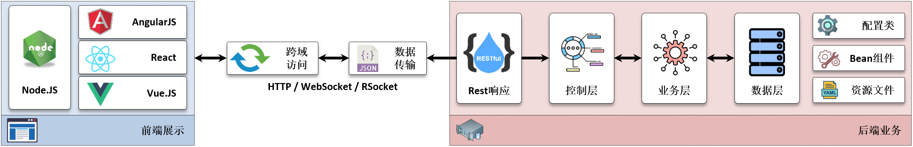

沐言科技 —— 李兴华编程训练营
===========================
```
沐言科技（www.yootk.com）是由李兴华老师亲自打造的高端软件编程教育训练营，
也是中国唯一一家拥有自主教材与教学资料研发的专业编程教育机构，是中国新一代软件教育的领导者与缔造者。
```

<strong>
<p>做我们自己的教育，不需要去和其他机构比较，因为我们搞的是教育，其他培训机构搞的是商业运作。</p>
<p>师资全部来自于一线大厂技术架构，讲师开发经验平均为8 ~ 15年，技术深度行业之最。</p>
<p>行业技术引领，传播行业内最新最流行的软件技术，为广大技术爱好者带来最有价值的编程教育体系。</p>
<p>近千万的真实教学视频传播范围，500,000+的编程图书销量，行业之最。</p>
<p>精心设计的教学课程体系，我们只做行业领航者。</p>
<p>真正的一线技术讲师倾力打造“李兴华高薪就业编程训练营”，只为奋斗的你而努力。</p></strong>


****

<p>SpringCloud是Spring生态圈之中一项重要的开发技术套件，其所有的设计全部围绕着RESTful数据传输，并且基于RESTful设计实现了良好的结构化管理。在SpringCloud长期发展过程中形成了两套不同的组合套件，分别是SpringCloudNetflix以及SpringCloudAlibaba，而随着Netflix组件的逐渐闭源化管理，本套课程将以SpringCloudAlibaba套件为主进行全面且丰富的知识体系讲解，同时考虑到了实际应用以及就业环境的需要，又对SpringCloudNetflix中的核心组件进行了详细分析，在本次课程中所涉及到的知识内容包括如下几项：</p>
<p><strong>1、完整的分析了业务中心技术的发展历史，从业务中心搭建的意义到RPC技术，再到WebService技术的发展历程；</strong></p>
<p><strong>2、基于Gradle构建工具实现SpringCloud项目开发；</strong></p>
<p><strong>3、基于SpringBoot实现了RESTful基础架构的搭建，并详细的讲解了Swagger文档工具的作用与实例应用；</strong></p>
<p><strong>4、基于最新的Nacos 2.x讲解了Nacos注册中心的搭建与使用，并基于Nginx与HAProxy实现了集群服务管理以及gRPC注册代理支持；</strong></p>
<p><strong>5、详细解释了Nacos中基于AP与CP模式的使用特点，并基于集群环境实现了模式的动态切换处理；</strong></p>
<p><strong>6、为便于读者理解微服务的注册管理，使用了NacosClient讲解了Nacos服务实例管理以及配置项的管理操作机制；</strong></p>
<p><strong>7、讲解了Netflix套件中提供的Ribbon服务组件，并通过其实现了REST服务的负载均衡调用处理，同时通过Ribbon源码详细解释了Ribbon的工作原理；</strong></p>
<p><strong>8、讲解了Feign组件的使用，并基于Feign组件实现了远程接口的映射处理，同时对Feign源代码进行分析，总结了其工作流程；</strong></p>
<p><strong>9、讲解了Netflix套件中提供的Hystrix组件，并结合了Actuator实现了微服务的性能监控管理；</strong></p>
<p><strong>10、微服务中为了实现合理的流量保护，提供了Sentinel限流工具，本课程完整的讲解了Sentinel的限流实现、原理分析以及配置规则持久化处理操作；</strong></p>
<p><strong>11、基于SpringCloudGateway实现了微服务路由管理，并详细的分析了路由谓词工厂、过滤器以及全局过滤器的使用；</strong></p>
<p><strong>12、完整的分析了SpringCloudGateway的运行流程，并通过其源代码解释了工作原理；</strong></p>
<p><strong>13、结合Prometheus与Grafana实现了SpringCloudGateway服务监控；</strong></p>
<p><strong>14、通过实例讲解了SpringCloudGateway所提供的动态路由规则配置；</strong></p>
<p><strong>15、基于JWT实现了微服务完整的认证与授权管理机制；</strong></p>
<p><strong>16、结合了SpringBootAdmin实现了微服务的监控与管理机制；</strong></p>
<p><strong>17、实战分析了Apache RocketMQ消息组件的使用，并通过源码详细解释了其完整的工作原理；</strong></p>
<p><strong>18、结合RocketMQ提供的事务消息处理机制并结合SETA实现了分布式事务管理与配置；</strong></p>
<p><strong>19、基于RocketMQ讲解了SpringCloudStream工作机制，并且通过其操作实现了SpringCloudConfig配置更新处理；</strong></p>
<p><strong>20、讲解了SpringCloud微服务监控机制，并通过实战的形式讲解了Zipkin、SkyWalking、Sentry、CAT组件的使用。</strong></p>

<p>我们在2019年的时候创办了沐言科技，希望可以用我们自己的信仰打造出全新的教学理念，因为长期以来我发现仅仅依靠简单的技术教学是不能够让学生走上技术岗位，现在的技术招聘更多的是强调学生的自我学习能力，所以我们也秉持着帮助学生自学提升技术的方式进行图书的编写，同时我们也会在抖音与B站直播间进行各种技术课程的公益直播，也欢迎广大学子扫描下图所示的各个二维码在不同的平台找到我们与我们互动，让我们一起进步，打造出适合于所有学生的教学模式，也欢迎广大读者可以将我们的视频上传到各个平台上，把我们的教学理念传播给更多有需要的人们。</p>
<p></p>
<p>本书是完全原创的技术类图书，我们已经尽可能的进行错误与歧义文字的排查，但是由于人工有限，难免会出现文字或图形表达不准确的问题，对于这些也希望广大读者可以帮助我们检查，如果发现问题欢迎将错误信息发到我的邮箱（784420216@qq.com），我们也会及时修改，如果读者需要获取相关的课程资源，可以登录沐言优拓（www.yootk.com）的官方网站通过资源导航获取下载链接。</p>
<p></p>
<p>最后的最后我想说的是，因为写书与各类的公益技术直播，我错过了许多与我孩子和家人欢聚的时光，我内心感到非常的愧疚，但是我希望不久的未来我能为我的孩子编写一套属于他自己的编程类图书，帮助所有有需要的孩子进步，因为我喜欢研究编程技术，也勇于自我突破，如果你也是这样的一位软件工程师，也希望加入到我们这个公益技术直播的行列之内，让我们抛开所有的商业模式的束缚，一起将自己学到的技术传播给更多的爱好者，以我们微薄之力推动整个行业的技术发展，就如同我说过的，教育的本质是分享，并不是赚钱的工具。</p>

****

|Author|李兴华|
|---|---
|E-mail：|784420216@qq.com
|课程咨询微信：|muyan_yootk
|课程咨询QQ：|2273627816
|VIP课程大纲：|edu.yootk.com

